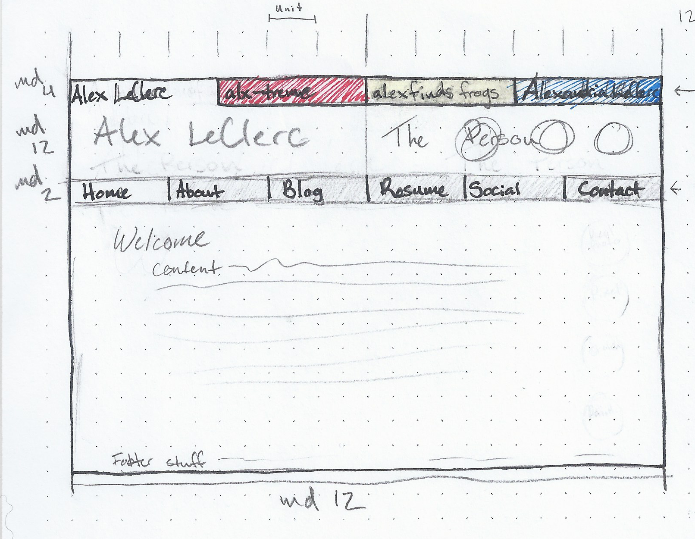
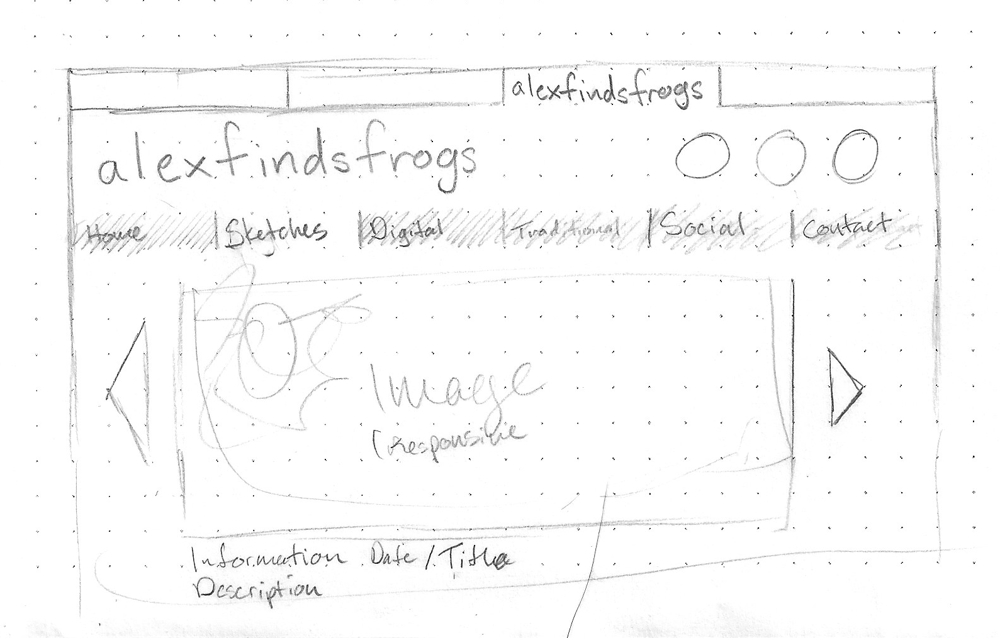
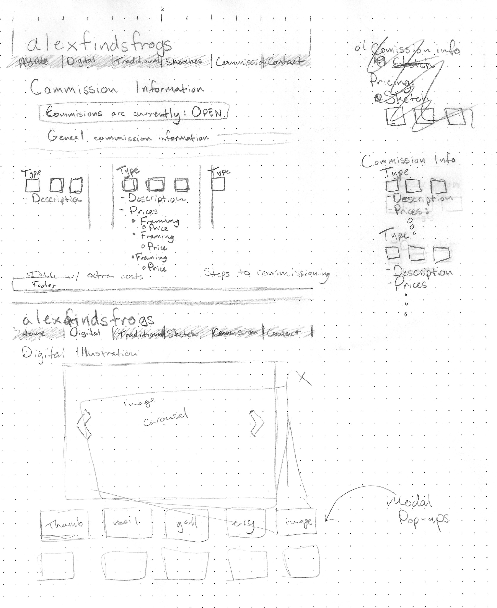
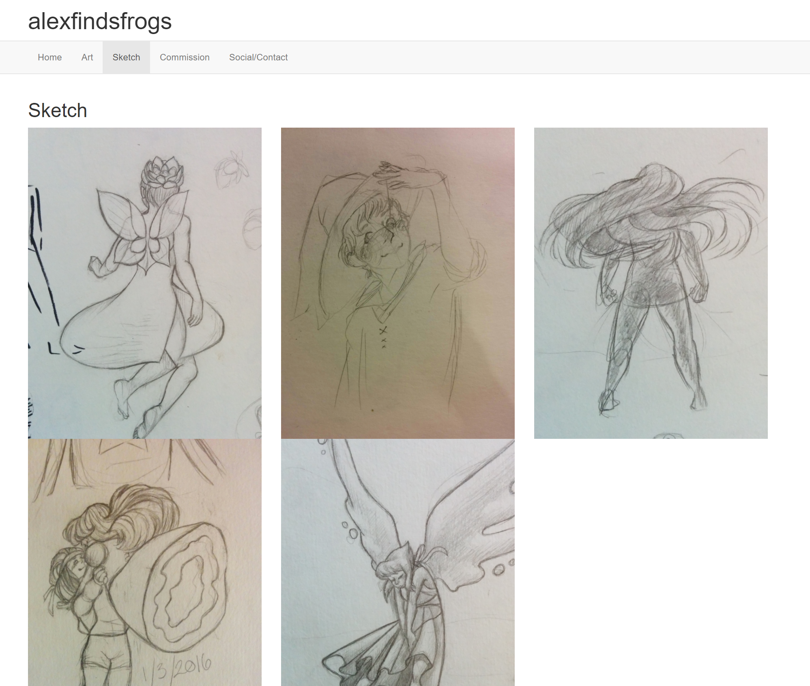
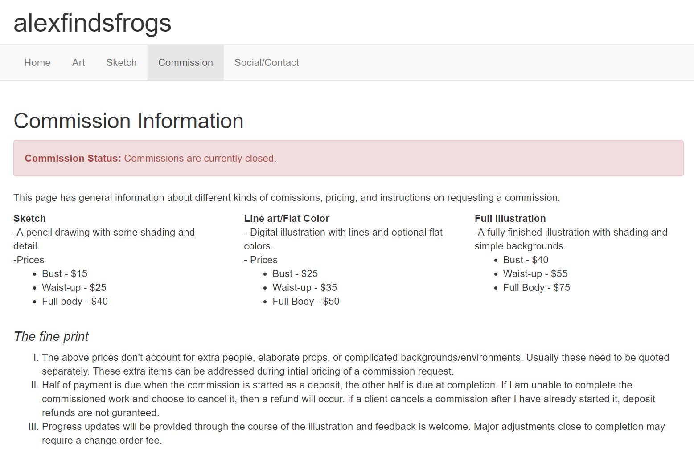
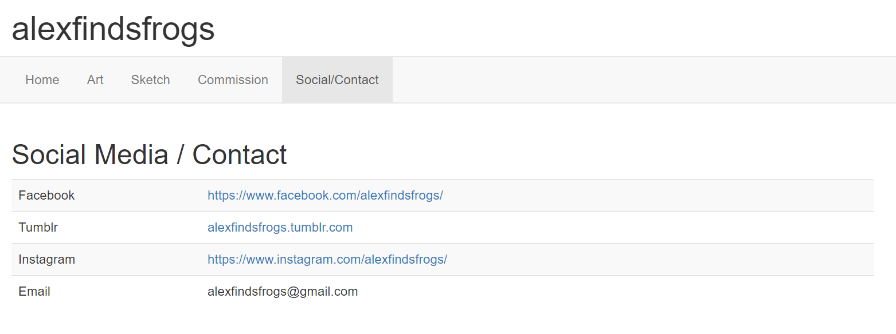
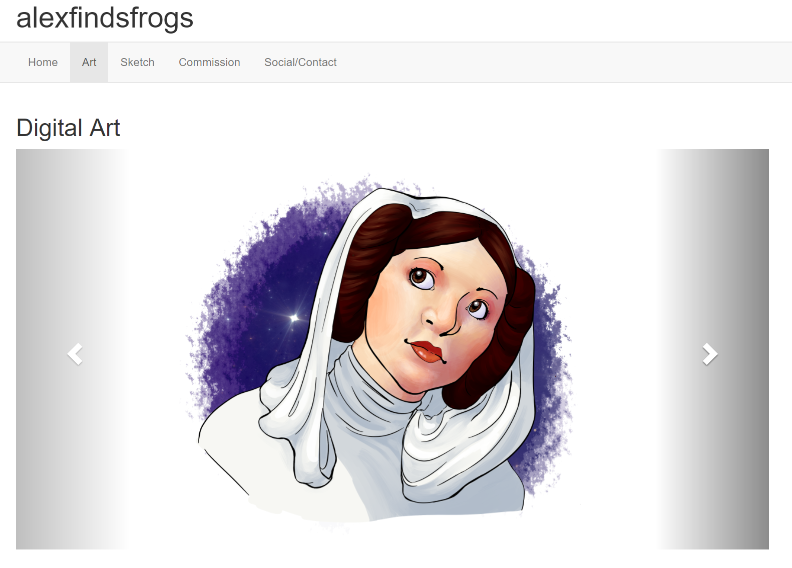

# Homework 1 (CS460)

For the first homework we were asked to learn the basics of HTML and CSS, using git from the command line, and using Bootstrap for the layout. Luckily, I had some previous experience with HTML, CSS, and GitHub. 

I was unfamiliar with Bootstrap and the command line version of git, so I spent the most time figuring out how to make a nice layout with Bootstrap.

I wanted to make something that I could use later, and decided on the layout for a portfolio style website to hold my personal info (resume and whatnot), my developer information, and my two different genres of art work. Eventually I scaled the concept down to developing only one of these sections.

## 1: Git Set-up
Over the summer I made a GitHub account and used the GitHub GUI, but I hadn't used the command line version so I had to download that from [Git-scm](https://git-scm.com/). 

*I am on a windows machine, but only use the Windows Command line when forced to, so I use the Git Bash with Linux commands.*

```
git init
git add . 
git commit -m "First commit."
```

I accidently did this the hard way, by starting my project in a local repository and then having to set the Remote repository and link the two. I used the documentation on [this page](https://help.github.com/articles/adding-an-existing-project-to-github-using-the-command-line/) as a guide.  
```
git remote add origin https://github.com/alexleclerc/CS460.git
git -v 
origin  https://github.com/alexleclerc/CS460.git (fetch)
origin  https://github.com/alexleclerc/CS460.git (push)
```
Later I made my remote repositories on github and just cloned them on my machine.

## 2: Webpage
I had made HTML websites styled with CSS over the summer, so I had no trouble with that. However I did not know where to begin with Bootstrap (though I wish I had, would have saved so much time!) so I turned to two places: [Bootstrap getting started website](https://getbootstrap.com/docs/3.3/getting-started/) and [W3Schools Bootstrap tutorial](https://www.w3schools.com/bootstrap/) and [Bucky Roberts (aka thenewboston's) tutorials on youtube](https://thenewboston.com/videos.php?cat=373). 

I started out with the 'Hello World' template from Bootstrap's website, did some reading and started planning.


I mulled over what to do with my webpage for longer than I should have. I wanted something that I could use later. I drew out some ideas on dot grid paper. 

I started out thinking too big, with a website with 4 sections that each functioned as their own little website...

  

I realized I didn't have time for that so I chose to focus on the page that I would have the easiest time making and would fit all of the homework requirements. I decided on the illustration page (**alexfindsfrogs**).

  


### 2.1 Bootstrap & Navbar
With a plan in place I made the HTML structure for all of the pages, and made the navigation bar with the proper links: 
```html
<!DOCTYPE html>
<!--The landing page of my art website. In the future this will probably have an about section and such.-->
<html lang="en">
  <head>
    <title>alexfindsfrogs</title>
    <!-- Required meta tags -->
    <meta charset="utf-8">
    <meta name="viewport" content="width=device-width, initial-scale=1">
    
    <!--Bootstrap CSS-->
    <link rel="stylesheet" href="https://maxcdn.bootstrapcdn.com/bootstrap/3.3.7/css/bootstrap.min.css">
    <script src="https://ajax.googleapis.com/ajax/libs/jquery/3.2.1/jquery.min.js"></script>
    <script src="https://maxcdn.bootstrapcdn.com/bootstrap/3.3.7/js/bootstrap.min.js"></script>
    
    
  </head>
  
  <body>
    <div class="container" id="banner">
        <h1>alexfindsfrogs</h1>
    </div>
            
    <div id="nav-wrapper">
        <nav class="navbar navbar-default">
            <div class="container">
                <ul class="nav navbar-nav">
                    <li class="active"><a href="./hw1-1-home.html">Home</a></li>
                    <li><a href="./hw1-2-digital.html">Art</a></li>
                    <li><a href="./hw1-3-sketch.html">Sketch</a></li>
                    <li><a href="./hw1-4-commission.html">Commission</a></li>
                    <li><a href="./hw1-5-social.html">Social/Contact</a></li>
                </ul>
            </div>
        </nav>
    </div>
     
    <div class="container" id="content">
        <h2>Welcome</h2>
            <p>This web page is home to my portfolio of illustrative work. This includes a mix of digital computer graphics art, traditional illustration work, and pencil sketches.</p>
    </div>
  </body>
</html>

```


### 2.2 Multi-Column Layout, Lists, and Table
The 'Sketch', 'Commission', and 'Contact' pages is where I met most of the requirements for the homework.

The Sketch page met the multi-column requirement:

```html
<div class="row">
    <div class="col-md-4">
        
    </div>

    <div class="col-md-4">
        
    </div>

    <div class="col-md-4">  
      
    </div>
</div>
        
<div class="row">
    <div class="col-md-4">
        
    </div>

    <div class="col-md-4">
        
    </div>
</div>
```
(*The alt text for the last two images isn't correct but I fixed it sometime later.*)



---

Commission page took care of the list requirement, (and also uses multi-column layout.)
```html
<div class="row">
    <div class="col-md-4">
        <dl>
            <dt>Sketch</dt>
            <dd>-A pencil drawing with some shading and detail.</dd>
            <dd>-Prices
                <ul>
                    <li>Bust - $15</li>
                    <li>Waist-up - $25</li>
                    <li>Full body - $40</li>
                </ul>
            </dd>
        </dl>
    </div>
            
    <div class="col-md-4">
         <dl>
            <dt>Line art/Flat Color</dt>
            <dd>- Digital illustration with lines and optional flat colors.</dd>
            <dd>- Prices
                <ul>
                    <li>Bust - $25</li>
                    <li>Waist-up - $35</li>
                    <li>Full Body - $50</li>
                </ul>
            </dd>
        </dl> 
    </div>

    <div class="col-md-4">
        <dl>
            <dt>Full Illustration</dt>
            <dd>-A fully finished illustration with shading and simple backgrounds.</dd>
            <dd>
                <ul>
                    <li>Bust - $40</li>
                    <li>Waist-up - $55</li>
                    <li>Full Body - $75</li>
                </ul>
            </dd>
        </dl>
    </div>
</div>
<div class="row">
    <div class="col-md-12">
        <h4><em>The fine print</em></h4>
            <ol type="I">
                <li>
                    The above prices don't account for extra people, elaborate props, or complicated backgrounds/environments. Usually these need to be quoted separately. These extra items can be addressed during intial pricing of a commission request.
                </li>
                <li>
                    Half of payment is due when the commission is started as a deposit, the other half  is due at completion. If I am unable to complete the commissioned work and choose to cancel it, then a refund will occur. If a client cancels a commission after I have already started it, deposit refunds are not guranteed.
                </li>
                <li>
                    Progress updates will be provided through the course of the illustration and feedback is welcome. Major adjustments close to completion may require a change order fee. 
                </li> 
            </ol>
    </div>
</div>
```


---

And lastly I had a table for the social media / contact page.

```html
<table class="table table-striped">
   <tbody>
       <tr>
           <td>Facebook</td>
           <td><a href="https://www.facebook.com/alexfindsfrogs/">https://www.facebook.com/alexfindsfrogs/</a></td>
       </tr>
       <tr>
           <td>Tumblr</td>
           <td><a href="alexfindsfrogs.tumblr.com">alexfindsfrogs.tumblr.com</a></td>
       </tr>
       <tr>
           <td>Instagram</td>
           <td><a href="https://www.instagram.com/alexfindsfrogs/">https://www.instagram.com/alexfindsfrogs/</a></td>
       </tr>
       <tr>
           <td>Email</td>
           <td>alexfindsfrogs@gmail.com</td>
       </tr>
   </tbody>
</table>
```


## 3. CSS Styling
If I ever get around to making the larger portfolio page, I wanted to keep the Red/Yellow/Blue color scheme, so this page uses yellow as the main color in anticipation of that later.

I also like to use pretty fonts on all of my design projects with text, and I found [Google's Font API](https://developers.google.com/fonts/docs/getting_started), which has a great [library of fonts](https://fonts.google.com/). I liked [Autor One](https://fonts.google.com/specimen/Autour+One) and [Nunito](https://fonts.google.com/specimen/Nunito).

Normally if they are used internally in the HTML file, you would use:
```
<link rel="stylesheet" href="https://fonts.googleapis.com/css?family=Autour+One|Nunito">
```
But I didn't want to mess with another style sheet so I just included the fonts in the top of my .css file like so:
```
@import url('https://fonts.googleapis.com/css?family=Autour+One|Nunito');
```
My css was pretty simple, I styled some of the given elements:
```css
body{
    background-color: #fffb50;
    font-family: "Nunito", sans-serif;
    color: #474447;
}

 h1, h2{
    font-family: "Autour One", sans-serif;
    font-weight: bold;    
}
```

I had some trouble styling the navbar. There are a lot of layers to the Bootstrap navbar. [This stackoverflow post](https://stackoverflow.com/questions/18529274/change-navbar-color-in-twitter-bootstrap-3) and Chrome's developer tools helped me figure out what Bootstrap classes I needed to target in order to override the styling:

```css
.navbar{
    margin-bottom: 0px;
    border: none;
    background-color: #474447;
}

.nav-default{
    background-color: #fffb50;
}

.navbar-default .navbar-nav>li>a {
    color: #FFFFFF;
}
.navbar-default .navbar-nav > li > a:hover,
.navbar-default .navbar-nav > li > a:focus {
    color: #FFFFFF;
}
```

I added my own divs to give the site different sections to style:
```css
#banner{
    background-color: #fffb50;
}

.pagebackground{
    background-image: url("images/frogtile.png");
}

.content{
    padding-left: 20px;
    padding-right: 20px;
    padding-top: 5px;
    padding-bottom: 10px;
    background-color: white;
    border-radius: 10px;
    margin: 20px;
}
```
I used an ID for the banner (the title header above the navbar) so I could target it individually. `pagebackground` and `content` could refer to sections on the page that all served the same purpose (a styled container) so I left them as classes.
## 4. The Cutting Room Floor...
Bootstrap has an easy way to make an 'image carousel' (a slideshow) and I really wanted to implement it because it shows up a lot on art portfolio websites. I read about it on  [W3Schools](https://www.w3schools.com/bootstrap/bootstrap_carousel.asp) and tried to use it:

```html
<div id="digCarousel" class="carousel slide" data-ride="carousel">

    <!-- Wrapper for slides -->
    <div class="carousel-inner">
      <div class="item active">
        
      </div>

      <div class="item">
        
      </div>

      <div class="item">
        
      </div>

      <div class="item">
        
      </div>
    </div>

    <!-- Left and right controls -->
    <a class="left carousel-control" href="#digCarousel" data-slide="prev">
      <span class="glyphicon glyphicon-chevron-left"></span>
      <span class="sr-only">Previous</span>
    </a>
    <a class="right carousel-control" href="#digCarousel" data-slide="next">
      <span class="glyphicon glyphicon-chevron-right"></span>
      <span class="sr-only">Next</span>
    </a>
</div>
```


However, the carousel is made with the assumption that all of the images are the same dimensions, or at least the same aspect ratio (like photographs that are all 4:3). My images weren't like that. 

I tried to make it work, (and wasted a bunch of time doing so), before scrapping it and just making it the same as the sketch page.