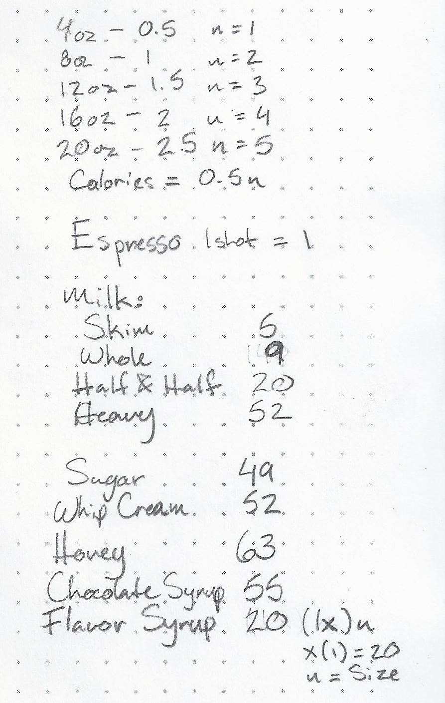
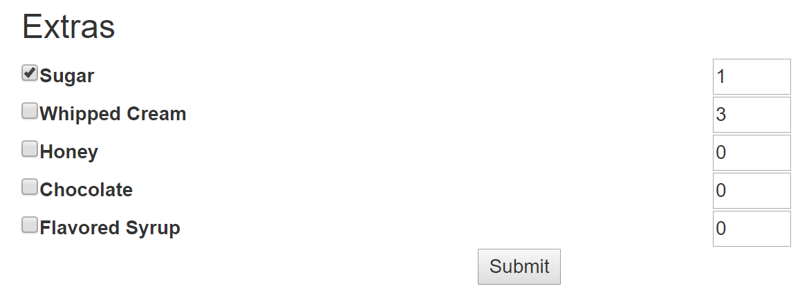
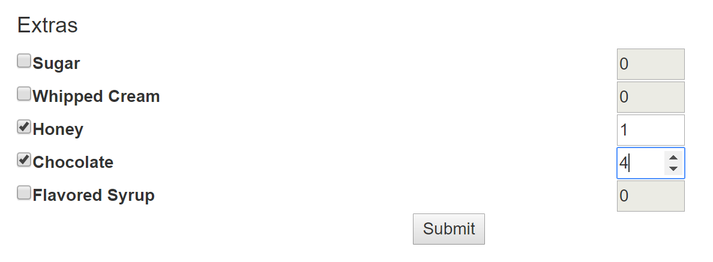
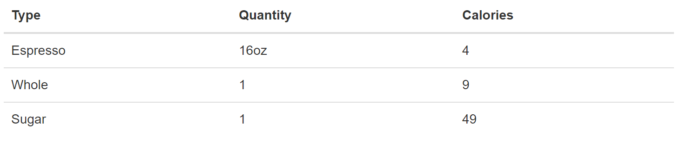
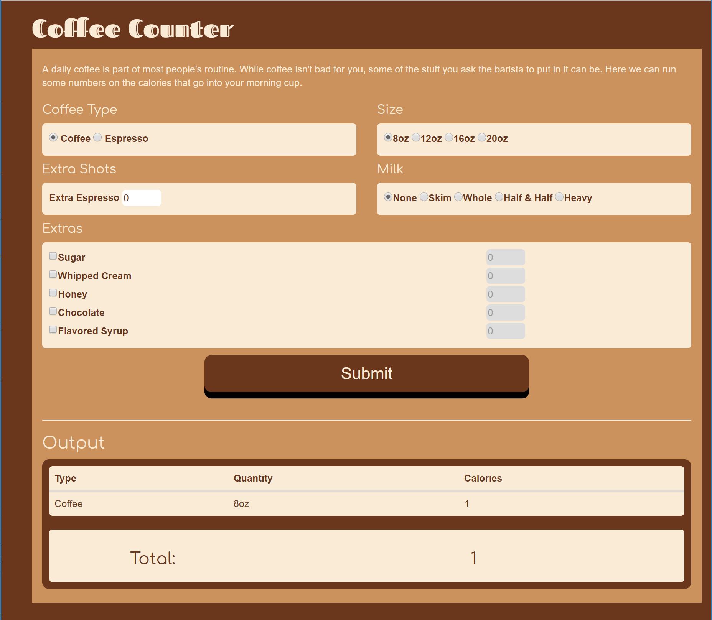
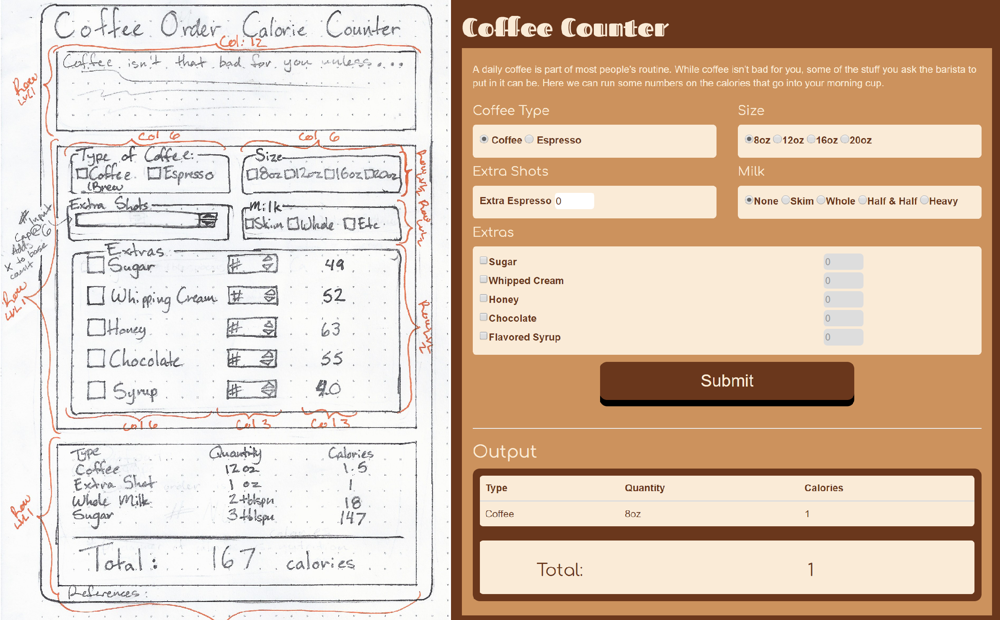

# Homework 2 (CS460)
The second homework requires us to apply what we learned from homework 1 with the addition of Javascript/jQuery functionality. I had experience with making dynamic forms with javascript and jQuery in the past so this wasn't too much of a challenge.

I originally wanted to make an english to morse code translator, but it would have been hard to meet the list/table requirements with that idea. I decided to make a counter for calories in coffee drinks instead as this would be more like 'computation' and could have output in a list or table.

## 1: Planning
##### Requirement(s) addressed: Concept, Wireframe
I started by googling up on the nutrition information available for coffee. I came across [Starbucks website](https://www.starbucks.com/menu/catalog/nutrition?food=all#view_control=nutrition), which lists each drink and its total calorie count. It didn't account for extra ingredients or list the individual ingredients. I found this [Coffee Makers website](http://coffeemakerpicks.com/how-many-calories-in-coffee/) that lists each individual items calorie count.

From there I made my wireframe. Usually it's easier for me to think about things and move stuff around on paper then in HTML, as when I start writing HTML I can get distracted by the details and not the overall structure.


At this point I have the visual layout as well as the input types each field in the form will be. I also wrote down the calorie count of each ingredient on the side of the page and some of the math behind calculating the total.



I have an idea of how I'll have the Javascript handle this in my head, with it retrieving certain elements in the form and multiplying them by quantity and adding to the total which will be printed out at the end.

## 2: HTML
##### Requirements addressed: Bootstrap, HTML, Branching, Multiple form elements

I create an `index.html`, (it includes only a h1 and a paragraph in bootstrap layout) in homework2 folder under my working local repository, commit & push it up to my remote repository, and start my first branch. For this I call my branch `add_page_structure` and add all the html elements, at this point focusing on how to organize the elements on the page using the proper bootstrap classes. 
```html
<div class="row">
    <div class="col-sm-6">
        <h4>Coffee Type</h6>
        <input type="checkbox" name="coffee">
        <label for="coffee">Coffee</label>

        <input type="checkbox" name="espresso">
        <label for="espresso">Espresso</label>
    </div>
    <div class="col-sm-6">
        <h4>Size</h4>
        <input type="checkbox" name="eightoz"><label for="eightoz">8oz</label>
        <input type="checkbox" name="twelveoz"><label for="twelveoz">12oz</label>
        <input type="checkbox" name="sixteenoz"><label for="sixteenoz">16oz</label>
        <input type="checkbox" name="twentyoz"><label for="twentyoz">20oz</label>
    </div>
</div>
```
I'm happy with the layout so I push the changes and merge with the main branch.

# 3: Javascript/jQuery
##### Requirements addressed: Branching, Responsiveness, Add Elements to Page
I start by making sure my form elements wouldn't have any unwanted behaviour that I would have to deal with later.  

### 3.1 Required Form Sections
I changed the *Coffee Type* and *Size* pieces of the form from checkboxes to radio buttons and added the names `coffeetype` and `size` so the radio buttons would work properly. These two sections are required so at first I had a function that returned whether or not both the `coffeetype` and `size` were set:
```html
function radioValidation() {
    return ($("input:radio[name='coffeetype'']").is(":checked") )&& ($("input:radio[name='size']").is(":checked"));
}
```
This would return true if a radio button under both `coffeetype` and `size` were checked. I ended up keeping this function but I also added a default selection on each of these so it was more intuitive and would require less error handling:

```html
<!--COFFEE TYPE-->
    <h4>Coffee Type</h4>
        <input type="radio" name="coffeetype" value="0.5" id="coffee" checked="checked">
        <label for="coffee">Coffee</label>

        <input type="radio" name="coffeetype" value="1" id="espresso">
        <label for="espresso">Espresso</label>
<!--/COFFEE TYPE-->
```

Another approach would be to add the `required` attribute to the element tag, but this puts a lot of faith in the browser to handle it correctly.

### 3.2 Extras Checkbox & Number Input Pairs
For my optional selections in the form I have pairs of checkboxes and number inputs that are under the same `name` with different `id`s. The idea being that you could check one of the `checkboxes` and then select the quantity from the `number input`. These were handled together but the values could be changed independently of each other. You could have *Sugar* checked (meaning you would want that selection) but no quantity. Or vice versa:

Unexpected results could come from this by jQuery pulling these values by the name. So I included this function that disables and sets the number input to zero when the box is unchecked:
```javascript
//if the class 'extras' is checked we set it's value to one, and then the user can increase it.
$(".extra:checkbox").change(function(){
    //I append the javascript this.name into the jquery string for the selector so that the checked box only changes the number input field with the same name.
    if(this.checked){
        $("input[type='number'][name= " + this.name + "]").val('1');

        //set the min for checked boxes
        $("input[type='number'][name= " + this.name + "]").attr({"min":"1"});
        //let it be changed
        $("input[type='number'][name= " + this.name + "]").prop('disabled', false);

    }
    else{
        $("input[type='number'][name= " + this.name + "]").val('0');
        //if this box was checked and then unchecked, the min  value would no longer be zero, but one. That would mess up our logic!!
        $("input[type='number'][name= " + this.name + "]").attr({"min":"0"});
        //change it back to disabled
        $("input[type='number'][name= " + this.name + "]").prop('disabled', true);

    }
});
```
The form elements start off as unchecked and disabled. When any of them are changed, we look for all the checked inputs a change them to enabled and their minimum to 1. If they are unchecked, we reset their value to 0 and disable them. I use `this` selector to prevent having to manage all of the unique `name` and `id` pairs.

### 3.3 Calculating
I want to do two things: add the total amount of calories from all form elements, and make a table with itemized list of all the selections.  
I sit and think about how this should work before I start pulling numbers and adding them together. I like to think of what the submit button is supposed to do. I look at the elements on the page, my wireframe, and their `class`es, `name`s, and `id`s. This is the plan I come up with:

when submit button is clicked:
2. get coffee type, multiply by size, add to total
4. add extra shots to total
5. if milk is checked, add to total
6. for each checkbox in extra class, multiply value x corresponding number input for name in form, add to total

Now I work on the logic to this and break it up into functions relatively close to each step.

```javascript
function coffeeTypeTotal() {
    coffeeBase = $("input[name='coffeetype']:checked").val();
    coffeeSize = $("input[name='size']:checked").val();
    return coffeeBase * coffeeSize;
}

function shotsTotal() {
    return parseInt($("#shots").val());
}

function milkTotal() {
    return parseInt($("input[name='milk']:checked").val());
}
```
I use jQuery to pull out the value by name and checked status, and return the value set for that element. For the coffee I have to multiply the type by the size to get the total.

The extras are a little tougher, having to grab all of the checked elements and multiply by their corresponding `number input` and returning the sum all of the checked options.
```javascript
function extraTotal() {
    var sum = 0;
    $(".extra:checkbox").each(function(){
       if(this.checked){
           sum += $(this).val() * $("input[type='number'][name= " + this.name + "]").val();
       } 
    });
    return sum;
}
```
Most of these functions I tested the main jQuery lines in the browser console to make sure they were grabbing what I wanted in the type I wanted, and then added them to the functions.

I added these functions to the function that was called by the submit button `onsubmit`, and later added them to their own function that handled all of the totaling functions.

### 3.4 Table Output
Making the table to add to the page was daunting, and again I had to think carefully about what I wanted to do before trying to build functions. I made another plan: 

1. function grabs the coffeetype and size, and their total calories
2. if extrashots.val > 0, add "extra shots" to 1st td and then quantity and total calories (which is equal to the quantity)
3. grab milk, put 1 as quantity, add calories 
4. for extras, add name, quantity 

I used the tags on my elements to pull out the information I wanted with jQuery. The `labels` gave me the text to put into the table, and the size/quantity for the quantity, and the value for the calories. The function returns an array with this information.  
Each section of the form does need to be handled differently so again they are given their own functions to handle this.
```javascript
//grab the two id's, just to make the next step easier to read
var coffeeID = $("input[name='coffeetype']:checked").attr('id');
var sizeID = $("input[name='size']:checked").attr('id');

//grab the text from the label for the element for our output
var coffeeLabel = $("label[for='"+coffeeID+"']").text();
var sizeLabel = $("label[for='"+sizeID+"']").text();

var coffeeCalories = $("input[name='coffeetype']:checked").val() * $("input[name='size']:checked").val();

var coffeetr = [coffeeLabel, sizeLabel, coffeeCalories];

return coffeetr;
}
```

The `milk` and `shots` row functions are similar to this function.   
But again the `extras` is different because it is set up with different form elements and functionaility in mind.
```javascript
function extraRows(){
   var extrasArr = [];
    //for each of the checked checkboxes in the .extras class
    $(".extra:checkbox:checked").each(function(index){
       //grab the current elements ID
       thisID = $(this).attr('id');
       //use the id to retrieve the label text
       var thisLabel = $("label[for='"+thisID+"']").text();
       //and the quantity of the item with this name
       var thisNum = parseInt($("input[type='number'][name= " + this.name + "]").val());
       //multiply the calorie value by the quantity
       var thisCalorie = parseInt($(this).val()) * thisNum;
       //create an array
       var thisRow = [thisLabel, thisNum, thisCalorie];
       //add that array inside the return array
       extrasArr[index] = thisRow;
    });
    return extrasArr;
}
```
I have a function that calls the functions for each different row. If something in that row is selected, the array for the row is added to the table array with `.push`.
```javascript
function tableMaker() {
    var tablearr = [];

    tablearr.push(coffeeRow());

    if(parseInt($("#shots").val()) > 0)
    {
        tablearr.push(shotsRow());
    }

    if($("input[name='milk']:checked").attr('id') != "none")
    {
        tablearr.push(milkRow());
    }

    if(extraRows().length > 0)
    {
        extratr = extraRows();
        $.each(extratr, function(i,a){
            tablearr.push(a);
        });
    }
```

The function then uses a nested jQuery `.each` loop to go through the 2D array that holds the row arrays. Each row array is added inside a `<tr>`, and each element of the row array is added inside a `<td>`. The whole string is attached to the table structure inside the page HTML.

```javascript
    var html = "";
    $.each(tablearr,function(i,a){
        html += "<tr>"
        $.each(a, function(ind,arr){
            html +="<td>"
            html += tablearr[i][ind];
            html +="</td>"
        });
        html += "</tr>"
    });
    $('#outtable > tbody').html(html);
}
```
Add this function to the function called by `onsubmit`, and now the submit button makes a table.


## 4: CSS, Finishing touches
##### Requirements addressed: CSS 
For the CSS I just wanted to visually separate the different parts of the form on the page. I tried to do this by adding a class to all of the `col-sz-##` divs, but this ended up messing up some of bootstraps rules for positioning divs. 

I also tried to use div>div>div, but my divs were not nested consistingly enough for this to work how I wanted. 

Instead I had to add new divs with their own class for elements I wanted to draw attention to.

```html
<!--COFFEE TYPE-->
    <h4>Coffee Type</h4>
    <div class="inside">
          <input type="radio" name="coffeetype" value="0.5" id="coffee" checked="checked">
          <label for="coffee">Coffee</label>

          <input type="radio" name="coffeetype" value="1" id="espresso">
          <label for="espresso">Espresso</label>
    </div>
<!--/COFFEE TYPE-->
```
I used a color palette I found on [this site](http://colorpalettes.net/color-palette-3497/) for the theme, and added fonts from [Google's](https://fonts.google.com/specimen/Fascinate+Inline) [font library](https://fonts.google.com/specimen/Comfortaa) again, for no reason other than the pretty fonts make me happy. 

I also style my submit button and my output to stand out from the rest of the page.



Side-by-side with wireframe: 
