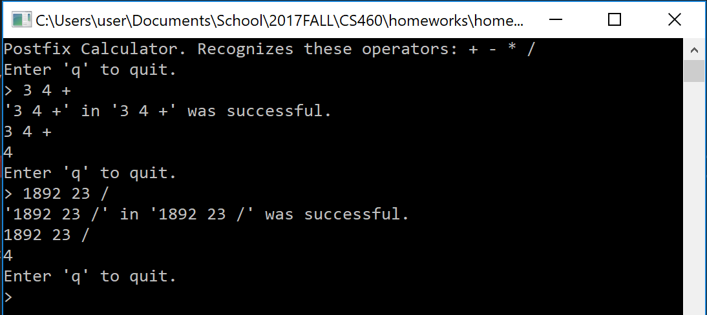
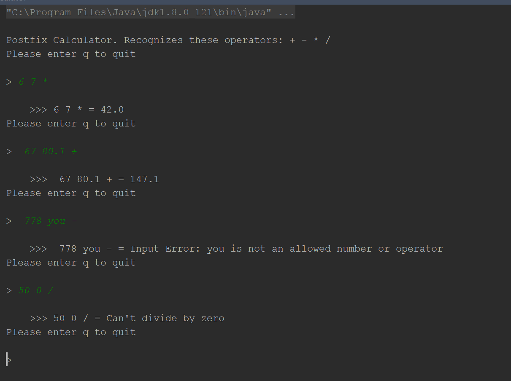
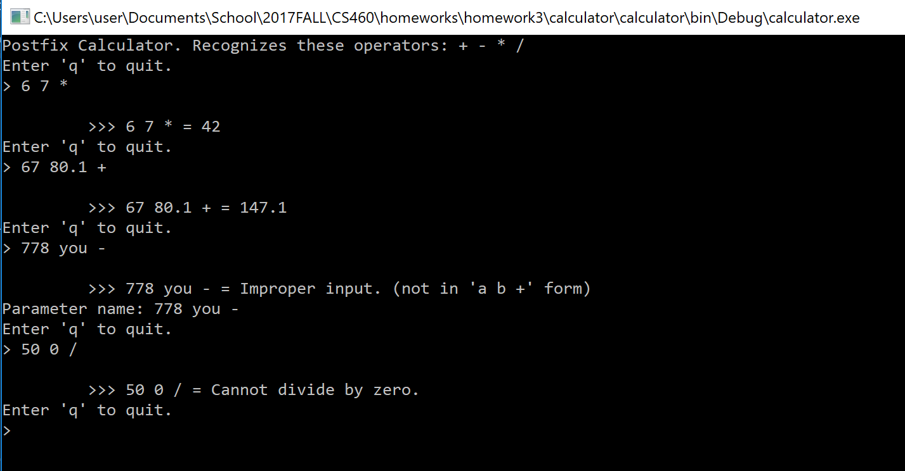

# Homework 3
[Repo](https://github.com/alexleclerc/CS460/)
For this homework we are tasked with learning C#, using visual studio, and translating some Java code to C#. 

I had tried to learn some C# in the past, to work with HoloLens, but ran into some road blocks with the documentation, so I didn't get very far. Hopefully this will go better.
## 1: Install Visual Studio
##### Requirements Addressed: Installing Visual Studio
As I said, I had tried to use some C# over the summer, so I still have Visual Studio 2017 installed. That was easy.

## 2: Investigate Java Program
I download the Java code and get it running in Intellij IDE. It doesn't look too complicated, but it is a little clunky.  I run it and it seems to work with most inputs and handles improper inputs.

I figured it would be easier to use all of the defined data structures classes, and implement them rather than make a calculator and force it to work with the classes after the fact. So I defined the data structures classes first and then worked on the main app class.

I kept the [Naming](https://docs.microsoft.com/en-us/dotnet/standard/design-guidelines/naming-guidelines) guidelines and the [Coding](https://docs.microsoft.com/en-us/dotnet/csharp/programming-guide/inside-a-program/coding-conventions) conventions handy as I converted all of the code to C#.

## 3: Conversion
##### Requirements Addressed: Learning C# Conventions, Branching Work
I create a new branch to store my code in and get to work.

### 3.1 Conversion
The external classes are mostly the same, with some discrete syntax and convention differences.

**Java:**
```java
/**
 * A simple singly linked node class.  This implementation comes from 
 * before Java had Generics.
 */
public class Node
{
	public Object data;	// The payload
	public Node next;	// Reference to the next Node in the chain
	
	public Node()
	{
		data = null;
		next = null;
	}
	
	public Node(Object data, Node next)
	{
		this.data = data;
		this.next = next;
	}
}

```
___
**C#:**
```C#
using System;

/// <summary>
/// Node class for a singly linked list data structure. 
/// </summary>
public class Node
{
    public object Data; //Payload
    public Node Next; //the next node in the chain

	public Node()
	{
        Data = null;
        Next = null;
	}

    public Node(object data, Node next)
    {
        Data = data;
        Next = next;
    }
}
```
The class that will hold the main functionality is just a skeleton at this point. All of the classes related to the data structure are ready to go though.

From this point I start diving into the main function, and most of it is just writing the Java code in C# flavor. I use `WriteLine()` to make sure that everything is compiling and assigning correctly as I go.


```c#
private bool DoCalculation()
    {
        Console.WriteLine("Enter 'q' to quit.");
        string Input = "2 2 +";
        Console.Write("> ");

        Input = Console.ReadLine();

        if (Input.StartsWith("q") || Input.StartsWith("Q"))
        {
            return false;
        }

        string Output = "4";

        Console.WriteLine(Input);
        Console.WriteLine(Output);

        return true;
    }
```

### 3.2 Scanner Woes
Parsing the user input is done by the Java Scanner class in the original. I look for the equivalent in C#, and learn that there is none.

I have to get creative. I consider using the `Parse()` function on the input string, but that seemed a little cumbersome and would require a lot of checks to make sure that the string was being parsed correctly.

I realized I could use a regular expression to easily grab the operator and the numbers from the input, and it would take care of some of the validation.

I play with the original Java code and notice it takes more than 3 numbers as valid input. I spent some time scratching my head as to how to use Regular expression (regex) groups to pull `n` number of groups.

I thought the java application was applying the operator to all three elements, and kept reading the code not understanding how. 

In an attempt to understand it better, I wrote my observations and a plan to address them in C# :  

**What is it doing?**
* Initializing variables
* checking for a next item   
    * checks if next item is number
	   * if true, 
	       * push it on the stack as a double
       * else, (its an operator or something)
           * get the next 
                * if it's bigger than 1 length
				throw error because thats not what we want!
			    * if theres nothing else,
				    * throw an exception because there's not enough arguments!
			    * assign b to the next popped double
			    * if theres nothing next
				    * throw an exception because theres	not enough arguments!
			    * assign a to the next popped double
			    * doOperation() on both arguments and operator, assign to c
			    * push c to the stack
			    * pop c off the stack in the return

**What mine should do:**
* Assign the first regex 
* If it's a match, 
	* evaluate group 1 (decimals)
		* perform a match all and pull out the decimals
	
		* push two decimal groups onto stack

I thought about how to use either the parse functionality or regular expressions for 2 + n number of arguments. After I was done thinking that through, I ran the java program again and realized it could take more than 2 arguments, but it would ignore any more arguments than the two before the operator. 

### 3.3 Regular Expresssions

With that understood, it's clear that a regular expression could replicate this very easily. I use an online browser tool, [Regex101](https://regex101.com/r/tywZlU/1) to test a regular expression that would get what was needed from the input string.

Regex101 illustrates in more detail, but generally it looks like:  

(\d+(?:\\.\d+)\*)\s(\d+(?:\\.\d+)\*)\s\*([\\+\\-\\*\\/])

- **\d+** finds a number with one or more digits
- **(?:\\.\d+)\*** allows for decimals, but doesn't require them, ?: doesn't capture this specific group
- **\s\*** optional space
- **([\\+\\-\\*\\/])** looks for +, -, *, or / at the end of the string.

I use some `WriteLine()` functions to make sure that the regular expression works.

```c#
public string EvaluatePostFixInput(string input)
{

    if (input == null || input.Equals(""))
    {
        throw new ArgumentException("Null or empty strings are not valid.", input);
    }
    Stack.Clear();

    string Pattern = @"(\d+)\s(\d+)\s([\+\-\*\/])";
    Match InputMatch = Regex.Match(input, Pattern);
    if (InputMatch.Success)
    {
        Console.WriteLine("'{0}' in '{1}' was successful.", InputMatch.Value, input);
    }
    else
    {
        Console.WriteLine("'{0}' in '{1}' was not successful.", InputMatch.Value, input);
    }
    return "nope";
}
```


It seems to match the string, so I check if it the capture groups are working:
```c#
public string EvaluatePostFixInput(string input)
{

    if (input == null || input.Equals(""))
    {
        throw new ArgumentException("Null or empty strings are not valid.", input);
    }
    Stack.Clear();

    //look for one or more digits (optionally with decimals)
    //followed separted by a space, followed by an operator
    string Pattern = @"(\d+(?:\.\d+)*)\s(\d+(?:\.\d+)*)\s*([\+\-\*\/])";
    Match InputMatch = Regex.Match(input, Pattern);
    if (InputMatch.Success)
    {
        //Console.WriteLine("'{0}' in '{1}' was successful.", InputMatch.Value, input);
        Console.WriteLine("number one : {0}, number two : {1}, operator: {2}",
            InputMatch.Groups[1], InputMatch.Groups[2], InputMatch.Groups[3]);
    }
    else
    {
        Console.WriteLine("'{0}' in '{1}' was not successful.", InputMatch.Value, input);
    }
    return "nope";
}
```
This works, so I start with the other functions.

### 3.4 Stack & Calculation
There are a number of ways I could have approached this, but I thought I should use the Stack since I went through the trouble of making sure it compiled.

After the groups are pulled from the string with the regular expression, if the match is successful we push the groups onto the stack. 

```c#
double result;

if (InputMatch.Success)
{
    //convert the Regex matches to doubles, put them on the stack.
    Stack.Push(double.Parse(InputMatch.Groups[1].Value));
    Stack.Push(double.Parse(InputMatch.Groups[2].Value));
    Stack.Push(InputMatch.Groups[3].Value.ToString());
    result = DoOperation();
}
```
Otherwise we'll throw an exception.
```c#
else
{
    throw new ArgumentException("Improper input. (not in 'a b +' form)", input);
}
```

In `DoOperation()`, we pop items off the stack to perform the operations. Most of these are simple, except for '`/`' (division), which requires some checking and exception throwing if improper input gets passed.

```c#
public double DoOperation()
{
    string op; //operator
    double a;  //first operand
    double b;  //second operand
    double c;  //answer

    //pop the top item into the operator
    op = Stack.Pop().ToString();
    b = Convert.ToDouble(Stack.Pop());
    a = Convert.ToDouble(Stack.Pop());

    switch (op)
    {
        case "+" :
            c = (a + b);
            break;
        case "-" :
            c = (a - b);
            break;
        case "*" :
            c = (a * b);
            break;
        case "/":
            try
            {
                c = (a / b);
                if (c == double.PositiveInfinity || c == double.NegativeInfinity)
                {
                    throw new ArgumentException("Cannot divide by zero.");
                }
            }
            catch (ArithmeticException)
            {
                throw new ArgumentException("Improper operation.");
            }
            break;

        default:
            throw new ArgumentException("{0} is not a proper operator.", op);

    }
    return c;
}
```
The notes in the Java program claim that you cannot use a `switch` statement on strings, that doesn't seem to be a problem in C#.

## 4: Output
##### Requirements Addressed: Identical Functionality
There are some small differences between the output of the Java postfix calculator and my C# version, but they don't seem to impede the functionality of the calculators.


