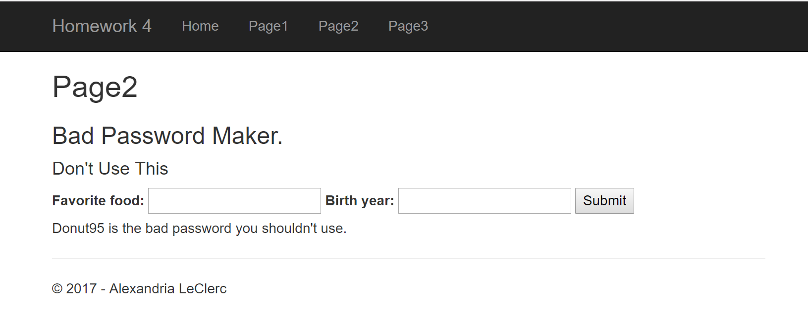

# Homework 4
[Repo](https://github.com/alexleclerc/CS460/)
For this homework the requirements specify that we need to make ASP.NET application that uses **M**odel **V**iew **C**ontroller (MVC) structure to complete a task. We do this without a database in this iteration. Next time we'll be using an interface.

## 1: Set Up Project
##### Requirements Addressed: Set up Empty MVC Project
I did a bit of reading to get familiar with how to set up an MVC project. It can be hard to find good documentation on this, but I tried to follow [Microsoft's 'Getting Started' page](https://docs.microsoft.com/en-us/aspnet/mvc/overview/getting-started/introduction/getting-started) on the subject.
I manage to make a little 'Hello World'. I use the controller class to return a view, which is just simply:
```html
<!DOCTYPE html>

<html>
<head>
    <meta name="viewport" content="width=device-width" />
    <title>Index</title>
</head>
<body>
    <div> 
        hello world
    </div>
</body>
</html>
```
## 2: Controllers & Views
I start trying meet the tasks given by the assignment, which require some form of Get/Post, taking user input, and displaying the altered input. These are mostly with controllers and views, without any database or much modeling.

### 2.1 Miles/Kilometer Converter
##### Requirements met: Form with get/post
From there I start working on the first task, starting with the form. It's just two `number` text inputs and a submit button. 


I then used the following in the controller:

```c#
[HttpPost]
[ActionName("Page1")]
public ActionResult Result1()
{
    double measure = Convert.ToDouble(Request.Form["measure"]);
    string unit = Request.Form["unit"];
    double result;
    string convertedunit;

    if (unit.ToUpper() == "MI" || unit.ToUpper() == "MILE")
    {
        //if the input was miles, convert to KM
        result = measure * 1.60934;
        convertedunit = "km";
    }
    else if (unit.ToUpper() == "KM" || unit.ToUpper() == "KILOMETER")
    {
        result = measure * 0.621371;
        convertedunit = "mi";
    }
    else
    {
        return Content($"Please input a number, and a unit (either mi/miles or km/kilometer");
    }
    return Content($"The result is: {result}{convertedunit}");
}
```
Pulling the information from the `Request.Form()` method and assigning it to the local parameters. I do a little bit of checking for my km/mi converter, and return the output on a new page. The conversion isn't the most accurate but this is just for practice.

The `Content` functions use C#'s version of formatting (`{param}`) to pull the local variables and display them.


### 2.2 Bad Password
##### Requirements addressed: Using FormCollection
The second task requires another practice of retrieving  form data, using a FormCollection and retrieving the elements that way. I take a 'favorite food' text field from my form (its just a text box) and a number input which is supposed to be a birth year. 


It appends the food and the last two digits of the birth year to make a really bad and insecure password.


```c#
[HttpPost]
public ActionResult Page2(FormCollection pageform)
{
    string food = pageform["food"];
    int birthyear = Convert.ToInt32(pageform["birthyear"]);
    int year2dig = birthyear % 100;

    string result = food + year2dig;

    ViewBag.genpassword = ($"{result} is the bad password you shouldn't use.");

    return View();
}
```

One thing I kept running into is I want to give each of the form elements an `id` instead of a `name` attribute. `Post` and `Get` methods don't like that and  work much beter with `name` attributes.

I then use a `Viewbag` to add this information onto the page and return the view on the same page.



This doesn't have as much validation as I would like but I don't have enough time to make it a fully fledge web page at this point in time.

I guess it's also a pretty useless page, but that's fine.

### 2.2 Loan Calculator
### Requirements addressed: Binding Parameters

I use the previously metioned tutorial on Microsofts MVC Getting Started page to add binding to the local parameters in the method.

```html
<form method="get" action="/Home/LoanCalculator">
    <label for="amount"> Current Balance: <input type="number" name="amount" min="0" step=".01" /> </label>
    <label for="rate">   Current Rate: <input type="number" name="rate" min="0" step=".01"/>%</label>
    <label for="term">   Current Terms: <input type="number" name="term" min="0"/></label>
    <input type="submit" name="submit" value="Submit" />
</form>
```
It was also important to make sure that the action was set to the correct page, so the Http knew where to send the information!

The page asks the user for their current balance, rate of interest and the terms they need to pay it off in to calculate the payment nessecary to pay off the loan.


 It took a little tweaking but the two can play nicely, with the form being passed through parameters into the controller function:
 
```c#
[HttpGet]
public ActionResult LoanCalculator(double amount, double rate, double term)
{
    double loanamount = amount;
    double loanrate = rate / 100;
    double loanterm = term;

    double top = (loanrate * loanamount);
    double bottom = (Math.Pow((1 + loanrate), (-1 * loanterm)));

    double payment = top / (1 - bottom);
    payment = Math.Round(payment, 2);

    return Content($"Current balance: {loanamount}, current rate: {loanrate} %, number of periods: {loanterm}, Payment each term: ${payment}.");
}
```
The input fields are bound to the parameters on the controller, and get passed in that way. Then we calculate the interest and determine how much would need to be payed each term to pay off the loan.

The output is put on a crude page.


## 3: Everything else
I had to create this Project in Visual Studio a few times before I figured out how to do it correctly. I couldn't figure out if it was better to use a completely blank project or start with an empty project with an MVC Scaffold. I ended up using the MVC Scaffold and editing the template to suit my needs.

The naming accross the different files was hard to keep track of and where most of my confusing was coming from and took up most of my troubleshooting time. I think it should get better with practice.