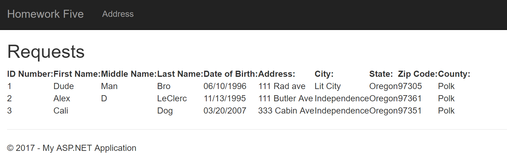

# Homework 5
[Repo](https://github.com/alexleclerc/CS460/tree/hw5/homework5)

For this weeks homework we are to replicate a [form from the Oregon DMV's website](http://www.oregon.gov/ODOT/Forms/DMV/6438fill.pdf). We're ignoring the signature and the voter information, but taking everything else from the form. It needs two pages, a page to view pending requests and a page to submit new requests. This will use a database but it will be a small one made from scratch (as opposed to an imported one).

## 1: Set up MVC
In the same way as the last homework, I use a scaffold to set up the project, [per the instructions on the same page as last time.](https://docs.microsoft.com/en-us/aspnet/mvc/overview/getting-started/introduction/getting-started) I edit the navigation bar to link to the correct pages.

## 2: Set up Database
To start with a model, I need to make a database. This is created with a SQL file (`DMV_up`), kept out of the working directory so not to mangle things.
I work a lot in SQL so this was pretty easy, just had to get the Transact-SQL syntax down:
```sql
CREATE TABLE dbo.Addresses
(
	ID			INT IDENTITY (1,1)	NOT NULL,
	FirstName	NVARCHAR(64)		NOT NULL,
	MiddleName	NVARCHAR(64),
	LastName    NVARCHAR(128)		NOT NULL,
	DOB			DateTime			NOT NULL,
	Addr		NVARCHAR(128)		NOT NULL,
	City		NVARCHAR(128)		NOT NULL,
	USState		NVARCHAR(128)		NOT NULL,
	Zip			INT					NOT NULL,
	County		NVARCHAR(128),
	CONSTRAINT [PK_dbo.Addresses] PRIMARY KEY CLUSTERED (ID ASC)
)
INSERT INTO dbo.Addresses (FirstName, MiddleName, LastName, DOB, Addr, City, USState, Zip, County) 
VALUES ('Dude', 'Man', 'Bro', '06/10/1996', '111 Rad ave', 'Lit City', 'Oregon', 97305, 'Polk');
```
It's added to the project folder `App_Data` using `Add > Existing Item`.

We can run it to create the database. When it's run it can be connected to a local server using the lil' connect button on the bar.


In server explorer sidebar we can check our tables as they are stored in the database to see if everything happened okay.

It took me once or twice to make sure that the SQL was working correctly to insert it into the database, but not very long at all. (I work with a database in my day job using PL/SQL, so I have a habit of doing things just *slightly* differently than standard SQL.)

I made a `DMV_down` file, but it had to be added after the fact due to computer problems.
```sql
ALTER TABLE dbo.Addresses DROP CONSTRAINT [PK_dbo.Addresses];
GO

DROP TABLE dbo.Addresses;
GO
```
## 3: Model

I create the model for the database so that the Addresses object will correspond with the Addresses Table. This is pretty simple, basically setting up the rules for how the two will interact.

### 3.1: Database Context
There is also a context class that needs to be added so that our entity references the data correctly.
``` c#
```

### 3.2: Connection String
It's also nessecary to edit the connection string in `Web.config` in order to tell the program where to look for our database. Our local database lives on the machie so we give it the following source:
```html
<connectionStrings>
    <add name="AddressContext" connectionString="Data Source=   (LocalDB)\MSSQLLocalDB;AttachDbFilename=C:\Users\user\Documents\School\2017FALL\CS460\homeworks\homework5\Homework5\App_Data\dbDMV.mdf;Integrated Security=True" providerName="System.Data.SqlClient"/>
</connectionStrings>
```
## 4: User Interface / Web Pages
I accidentally started out by making an HTML form in the view, but that wasn't nessecary (and I should have read the directions more clearly). Instead a razor form is better to connect our model to the form. 

### 4.1 Controller
The controller either brings us the address page if we need to load the information, 
```c#
[HttpGet]
    public ActionResult Address()
    {
        return View();
    }
```

Or if the information has been submitted then we are redirected to the 'Requests' page to look at the pending address change requests.

```c#
[HttpPost]
    public ActionResult Address([Bind(Include = "FirstName, MiddleName, LastName, DOB, Addr, City, USState, Zip, County")]Address address)
    {
        if (ModelState.IsValid)
        {
            db.Addresses.Add(address);
            db.SaveChanges();
            return RedirectToAction("Requests");
        }
        return View();
    }
    public ActionResult Requests()
    {
        return View(db.Addresses.ToList());
    }
```

### 4.2 View

In the `Address` view we have to make the form. Using razor we can easily add things like validation.
```c#
@Html.ValidationSummary(true, "", new { @class = "text-danger" })
```
It's best if the fields correlate back to the database fields, so we pull information from the model to create our form.
The labels and fields are pulled from the model.
```html
<div class="form-group">
    @Html.LabelFor(model => model.FirstName, htmlAttributes: new { @class = "control-label col-md-2" })
    <div class="col-md-10">
        @Html.EditorFor(model => model.FirstName, new { htmlAttributes = new { @class = "form-control" } })
        @Html.ValidationMessageFor(model => model.FirstName, "", new { @class = "text-danger" })
    </div>
</div>
```


In the `Requests` view we display the information that was added to the table using the model again. We have to structure it a little bit with HTML. The first part is the table headers.
```html
<h2>Requests</h2>
<table>
    <tr>
        <th>
            @Html.DisplayNameFor(model => model.ID)
        </th>
        <th>
            @Html.DisplayNameFor(model => model.FirstName)
        </th>
        <th>
            @Html.DisplayNameFor(model => model.MiddleName)
        </th>
        <th>
            @Html.DisplayNameFor(model => model.LastName)
        </th>
    .
    .
    . 
        <th>
            @Html.DisplayNameFor(model => model.County)
        </th>
    </tr>
```
Then it is important to make sure we add everything from the database to the view, so a `for each` loop is used to populate the webpage table for each `<tr>` and `<td>`.
```html
    @foreach (var item in Model)
    {
        <tr>
            <td>@Html.DisplayFor(modelItem => item.ID)</td>
            <td>@Html.DisplayFor(modelItem => item.FirstName)</td>
            <td>@Html.DisplayFor(modelItem => item.MiddleName)</td>
            <td>@Html.DisplayFor(modelItem => item.LastName)</td>
            <td>@Html.DisplayFor(modelItem => item.DOB)</td>
            <td>@Html.DisplayFor(modelItem => item.Addr)</td>
            <td>@Html.DisplayFor(modelItem => item.City)</td>
            <td>@Html.DisplayFor(modelItem => item.USState)</td>
            <td>@Html.DisplayFor(modelItem => item.Zip)</td>
            <td>@Html.DisplayFor(modelItem => item.County)</td>
        </tr>
    }
</table>
```

(it's not pretty.)

## The Cutting Room Floor
I also thought I should make an HTML form but I shouldn't have! Whoops. It didn't take very long, I thought it was a good place to start but I was wrong.

Things had been going smoothly with Git up until this point. For some reason the Visual Studio .gitignore file I was using was being committed properly so I ended up adding some binary files and whatnot to my repo when I shouldn't have. I will have to go back and remove them.  

I also had some problems with git trying to add homework4 files. I eventually fixed it without deleting anything by temporarily adding them to the gitignore in my root directory.

I also had computer problems right in the middle of working on this. (It's a long story involving corrupted Windows updates...) I forgot to remake my DMV_down file when SQL crashed so I had to add it in after the fact. 