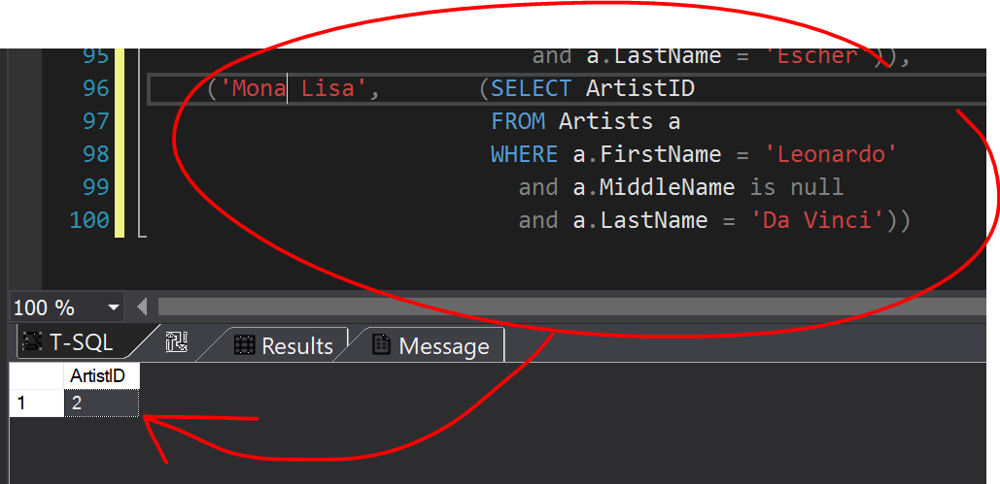
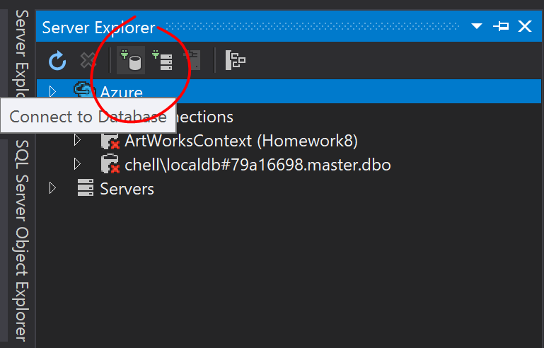
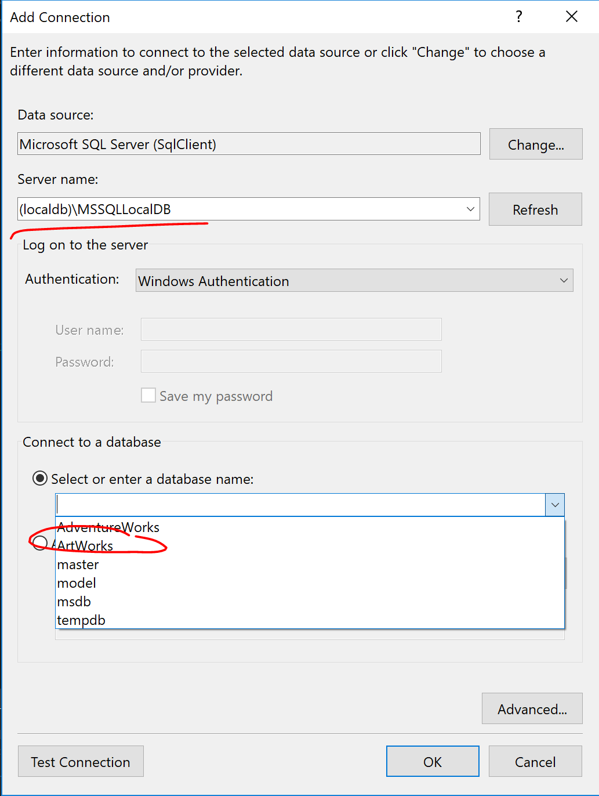
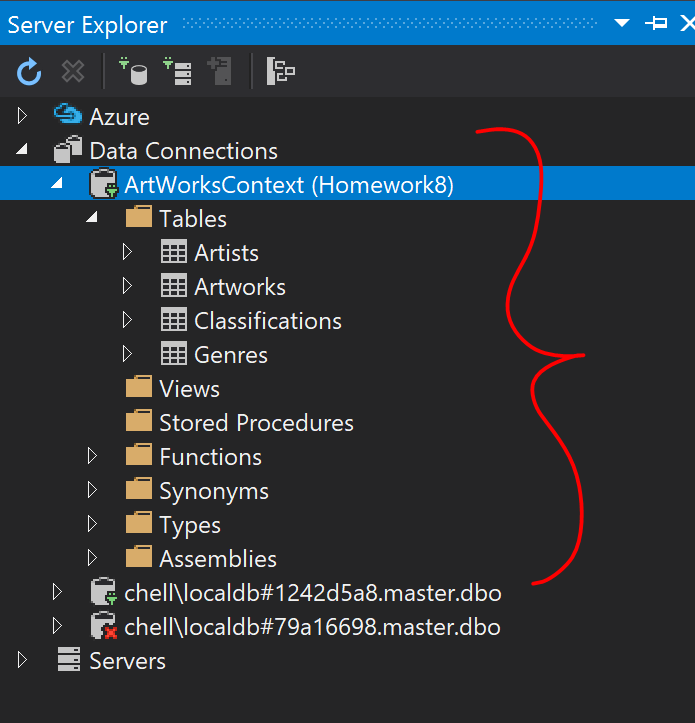
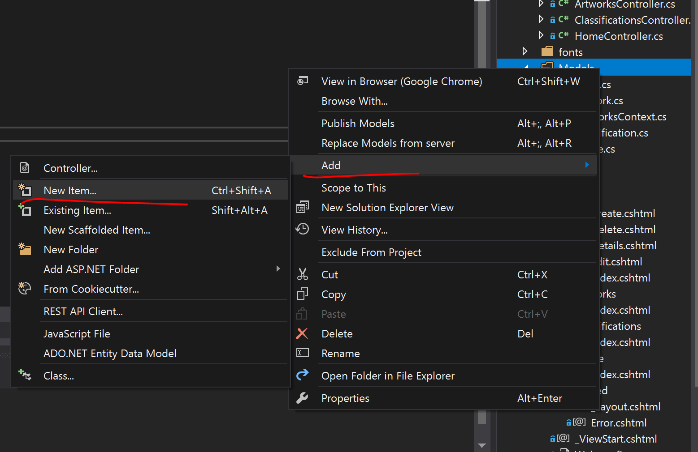
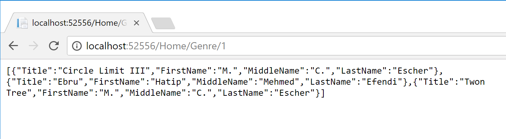

# Homework 8
[Repo](https://github.com/alexleclerc/CS460/tree/hw8)  

*homework description*

## 1: Entity Relationship Diagram
Using the information provided by [the lab website](linktotableinfo), I created an Entity Relationship (ER) Diagram.  

## 2: MVC App
I simply started by making an MVC project with a template, knowing I would have to cut out or replace most of what was in the Home controller and the extra about/contact views.

## 3: Database
Next step was to make the local database. We have been using UP and DOWN files in this class to keep it more friendly to cloning and backing up, so that's where I started.

### 3.1 Database UP
First I make my Database Up file (`ArtWorks_up.sql`) and make sure that I can get the table structure and constraints at least compiling in SQL. 

```sql
--based off of: https://docs.microsoft.com/en-us/ef/core/get-started/aspnetcore/existing-db
CREATE DATABASE [ArtWorks];
GO

USE [ArtWorks];
GO

CREATE TABLE [Artists] 
(
	[ArtistID] int NOT NULL IDENTITY,
	--I always separate names in databases into first, middle, last
	--in case they need to be searched through one name, or translated
	[FirstName] nvarchar(100) DEFAULT null,
	[MiddleName] nvarchar(100) DEFAULT null,
	[LastName] nvarchar(100) NOT NULL DEFAULT 'Anonymous',
	[BirthDate] date DEFAULT null,
	[BirthCity] nvarchar(100) DEFAULT 'Unknown',

	CONSTRAINT [PK_Artists] 
		PRIMARY KEY ([ArtistID])
);
GO
```
As the comments note, I split the name up into First, Middle, Last. I usually do this because I have to work with databases a lot and in my experience with SQL and data querying, it is much easier to combine name fields together for output than to split them apart. 

These databases also have to be relational, and I inserted surrogate (generated) keys (`ArtistID, ArtworkID`) into each table. I am always hesitant to use a field like `Name` as the primary key to a table, because it can make life complicated later if you ever need to make changes to a row in the table.

I started, while looking at my ER diagram, with the table with the least dependencies and then worked my way up so that the foreign keys can be added to the tables that followed.
```sql
CREATE TABLE [Artworks]
(
	[ArtworkID] int NOT NULL IDENTITY,
	[ArtistID] int NOT NULL,
	[Title] nvarchar(max),

	CONSTRAINT [PK_Artworks] 
		PRIMARY KEY ([ArtworkID]),
	CONSTRAINT [FK_Artworks_Artists_ArtistID] 
		FOREIGN KEY ([ArtistID]) 
		REFERENCES [Artists] ([ArtistID]) 
		ON DELETE CASCADE --if an artist is deleted from the database, delete all of their artwork too
);
GO

.
.
. (cont'd)
```

From there I make my insert statements, highlighting the SQL I want to run and testing it. I also had to make my DOWN file at this point to clear the tables when I acidentally inserted something I shouldn't have.

Artists `INSERT`: 
```sql
INSERT INTO [Artists] (FirstName, MiddleName, LastName, BirthDate, BirthCity) 
	VALUES 
		--remember, date formats are YYYY-MM-DD
		('M.', 'C.', 'Escher', '1898-06-17', 'Leeuwarden, Netherlands'),
		('Leonardo', null, 'Da Vinci', '1519-05-02', 'Vinci, Italy'),
		('Hatip', 'Mehmed', 'Efendi', '1680-11-18', null),
		('Salvador', null, 'Dali', '1904-05-11', 'Figueres Spain')
GO
```

In the Artworks `INSERT`, the artworks only need the title and an Artist ID to link it too. Since my ArtistID is a Surrogate key (as opposed to an assigned key or a composite key) I use a SQL subquery that selects the ArtistID from the Artists table by name. This way if the Artists `INSERT` statement is altered, the Artworks `INSERT` will still return the ID of the proper artist without having to change the hard-coded values. 

```sql
(...)
('Twon Tree',(SELECT ArtistID
			  FROM Artists a
			  WHERE a.FirstName = 'M.'
				and a.MiddleName = 'C.'
				and a.LastName = 'Escher')),
                
('Mona Lisa',(SELECT ArtistID
			  FROM Artists a
			  WHERE a.FirstName = 'Leonardo'
                and a.MiddleName is null
                and a.LastName = 'Da Vinci'))
(...)
```

To make sure my subqueries worked I selected and ran only the subquery to see what it returned, before using it to insert values into the table.



### 3.2 Database DOWN
Using the ER diagaram I made, I drop the table with the most constraints on it and work backwards from there. There are more complete ways to do this that don't have to rely on order, but this database is small so it will do the trick.

```sql
USE ArtWorks;
GO

--table with most foreign constraints
DROP TABLE dbo.Classifications;
GO

DROP TABLE dbo.Artworks;
GO

DROP TABLE dbo.Artists;
GO

DROP TABLE dbo.Genres;
GO

--switch to master so we can delete the database
--if we don't, compiler will tell us that the database is in use
--(because we're connected to it)
USE master;
GO

DROP DATABASE ArtWorks;
GO
```

### 3.3 Install Entity Framework

I use Entity Frameworks packages to make the models from the Package Manager Console, under  
**Tools > NuGet Package Manager –> Package Manager Console**  
Then three packages need to be installed: 
```
Install-Package Microsoft.EntityFrameworkCore.SqlServer
```
```
Install-Package Microsoft.EntityFrameworkCore.Tools
```
```
Install-Package Microsoft.VisualStudio.Web.CodeGeneration.Design
```

### 3.4 Connecting to Database
Then I have to connect to the database. I use the server explorer menu and click `Connect to Database`.



That opens the **Add Connection**. Under server name we enter **(localdb)\MSSQLLocalDB**. If the database was made correctly, after doing that ArtWorks should be pressent in the **Connect to Database** dropdown menu.



If the item is not in the dropdown menu, it probably wasn't created correctly. The **SQL Server Object Explorer** menu can be used to see what items have been created.

If all went well, the connection should be in Server Explorer menu now.


### 3.4 Creating Models
Now models have to be generated from the database. The easiest way to do this is by using our installed packages to generate items. Again, some of this will have to be cut out or altered by it gives a good starting point.

Right models, Add -> New Item 



Under Data, choose ADO.NET Entity Data Model -> Name it *[DBNameHere]*Context -> Next

To make this go smoothly it is **VERY important** that the name is the name of whatever the context needs to be, followed by *Context*.

On the next page, choose Code First from Database.

This will generate all of the models for us.

### 3.5 Creating Controllers

After, right click on controllers -> Add new Scaffolded Item -> MVC 5 Controller with Views using Entity Framework

Add the controller for the item we want to use (one of the tables) and the DbContext should pop up automatically (if the previous steps were done correctly). 

At the bottom confirm the name of the controller.

This should have generated the controller and the CRUD views. They are somewhat complete but should be tweaked to display and edit information properly.

### 3.6 Adjustments

Adding error messages and String Length and required fields in the Model:
```c#
[Required(ErrorMessage = "Last name is required.")]
[StringLength(50, ErrorMessage = "First name can't be longer than 50 characters.")]
public string LastName { get; set; }
```
I had trouble validating the birth date for the create/edit functions in Artist.

Instead I had to use [this method](https://stackoverflow.com/questions/35757426/mvc-5-validate-date-in-the-past) from StackOverflow. It makes a new ValidationAttribute in Artist model that checks to see if the date is before todays date.
```c#
public class RestrictedDate : ValidationAttribute
{
      public override bool IsValid(object date)
            {
                DateTime Date = (DateTime)date;
                return Date < DateTime.Now;
            }
        }
```
And then the Attribute is added to the BirthDate class in the model.
```c#
[Column(TypeName = "date")]
        [DataType(DataType.Date)]
        [DisplayFormat(DataFormatString ="{0:yyyy-MM-dd}")]
        [RestrictedDate]
        public DateTime? BirthDate { get; set; }
```

I originally had the display format as `MM/dd/yyyy` but it was causing problems when the `@HTML` helper was feeding the date input the wrong format.

### 3.7 Main Page JSON/AJAX

With the CRUD functions working correctly I then work on making the JSON/AJAX for the main page.

I edited the generated home controller to hold two functions, one to display the Index page and pass it Genres data:
```c#
 private ArtWorksContext db = new ArtWorksContext();

 public ActionResult Index()
    {
        return View(db.Genres.ToList());
    }
```

And another function that returns a `JsonResult` for Genres, taking an ID and using LINQ to feed it the information from the db context.
```c#
public JsonResult Genre(int id)
{
    var ArtCollection = db.Genres.Where(g => g.GenreID == id)
                                 .Select(x => x.Classifications)
                                 .FirstOrDefault()
                                 .Select(x => new { x.Artwork.Title, x.Artwork.Artist.FirstName, x.Artwork.Artist.MiddleName, x.Artwork.Artist.LastName })
                                 .OrderBy(x => x.Title)
                                 .ToList();
    //list object 
    return Json(ArtCollection, JsonRequestBehavior.AllowGet);
 }
```
It returns the following at Home/Genre/[id]:
  


In the Home view, I use Razor to loop through all the items in the Genre model to make buttons. The onclick function in each button displays information from my model and calls a function to getWorks javascript function, passing the GenreID from the model.

```html
<div class="btn-group">
    @foreach (var genre in Model)
    {
        <input type="button" class ="btn" value="@Html.DisplayFor(genreItem => genre.Name)" onclick="getWorks(@genre.GenreID)"/>
    }
</div>
```
(To call this Javascript function (which is in it's on .js file) the following is added to the bottom of the page:)
```html
@section scripts
{
    <script src="~/Scripts/getWorks.js"></script>
}
```

In the `getWorks.js` file, the `getWorks` function takes an id as a parameter then uses ajax to access the JSON data to something useful.

```javascript
function getWorks(id) {
    $.ajax(
        {
            type: "GET",
            dataType: "json",
            url: "/Home/Genre/" + id,
            success: (function (data) { displayArt(data) })
        }
    );
}
```
On success it passes the data to the displayArt function, defined in the same file. This function builds a string with the HTML to create a table for the list of Classifications of a certain Genre, using jQuery to iterate through each of the items, add the appropriate table tags, and add them to the string containing the HTML. At the end jQuery .append is used to add the items to an empty div defined in the Index view.

```javascript
function displayArt(inData)
    {
        $("#displayContainer").empty();
        //create a string for the start of our table
        var tableHTML = "<table class = \"table\"><thead><tr><th>Title</th><th>Artist</th></tr></thead><tbody>";
        
        $.each(inData, function (i, name) {
            tableHTML += "<tr>"
                + "<td>"
                + name["Title"]
                + "</td>"
                + "<td>";
            if (name["FirstName"] == null) {
                tableHTML += "";
            }
            else
            {
                tableHTML += name["FirstName"] + " ";
            }
            if (name["MiddleName"] == null) {
                tableHTML += "";
            }
            else {
                tableHTML += name["MiddleName"] + " ";
            }
              
                tableHTML += name["LastName"]
                + "</td>"
                + "</tr>";
        });
        tableHTML += "</tbody></table>";
        $("#displayContainer").append(tableHTML);

    }
```
At first I tried to use jQuery's append method to add everything to the div, but jQuery tries to be helpful when you do that and treats strings that are html tags as if it was just appending an HTML tag to the DOM, and will add the ending tags to the items. So if we append "<table>", with the intent to add to it, jQuery will close the tag before we append the rows inside. So a string builder was the easiest solution to that problem.

## 4:Final Product
I had to add the views for Artworks and Classifcations, but they were almost identical to the Artists index view, but without the CRUD elements.


