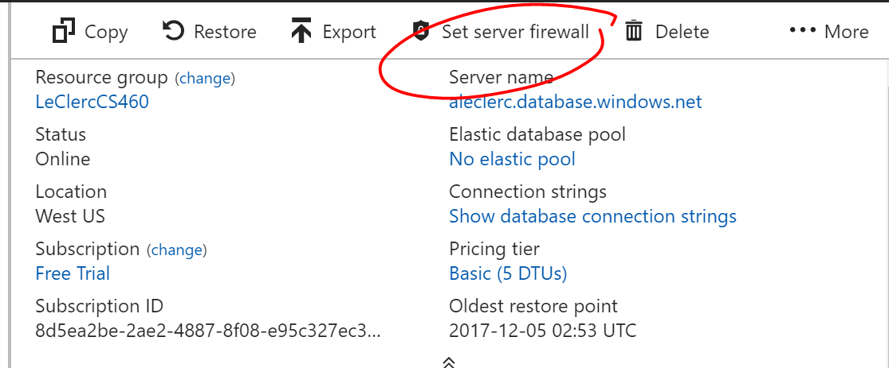

# Homework 9
Log into Azure, on the dashboard go to the left menu and click **SQL databases**. Click **Add +** at the top, filling in the information in the new menu that pops up.

Give it a name, choose subscription type, give it a resource group, select a source (blank) choose a server (which will let you make a login and pw) choose pricing, and select create.

We have to set a firewall rule exception. First, we go to databases, select the proper one,

 

And then copy the server name,  

Then click set server firewall

Click **+Add client IP**

This creates a new rule in the firewall for the local IP.

In visual studio, in the server explorer, under azure, we can add the database. We will need to use the username and password created when we made the server connection. 

Once that has happened, we open up the UP file for the project and connect to ArtWorks under azure, and create the tables.

That should be linked to Azure now, so we can go back to Azure Portal and under **App Services**, click **+Add** 

Select **Web App**, click **Create**, then fill out the rest of the form.

We have to make a new service plan, I use the free one at the bottom.

Now we have to Publish the local project to Azure. Right click the Project under the Solution in Visual Studio, and select **Publish** in the menu.
.

Then in that menu, select **Microsoft Azure App Service** & **Select Existing**, then click **Publish**

Choose an Account, Plan, and resource. Select the App Service previous made in Azure and then click **OK**.

After the project is published and deployed, go to SQL databases in Azure and select the database, click on the name of it (its a link) 

Then go to **Data Connection Strings**, click on that name link, and copy it to the clip board.

The one for this project looked like:

Server=tcp:aleclerc.database.windows.net,1433;Initial Catalog=ArtWorks;Persist Security Info=False;User ID={your_username};Password={your_password};MultipleActiveResultSets=False;Encrypt=True;TrustServerCertificate=False;Connection Timeout=30;

Go to app services, click on the project name link, 

Under application settings scroll down to connection string, add the name (exactly the same as the Context class in the Local project) and then the connection string copied from the previous step, but replacing the entirety of {yourusername} and {yourpassword} with the admin username and password (excluding the curly braces) and click **Save**.

The project should be ready to view now. It is viewable under app services, clicking on the name link, Overview, and under the URL portion.

